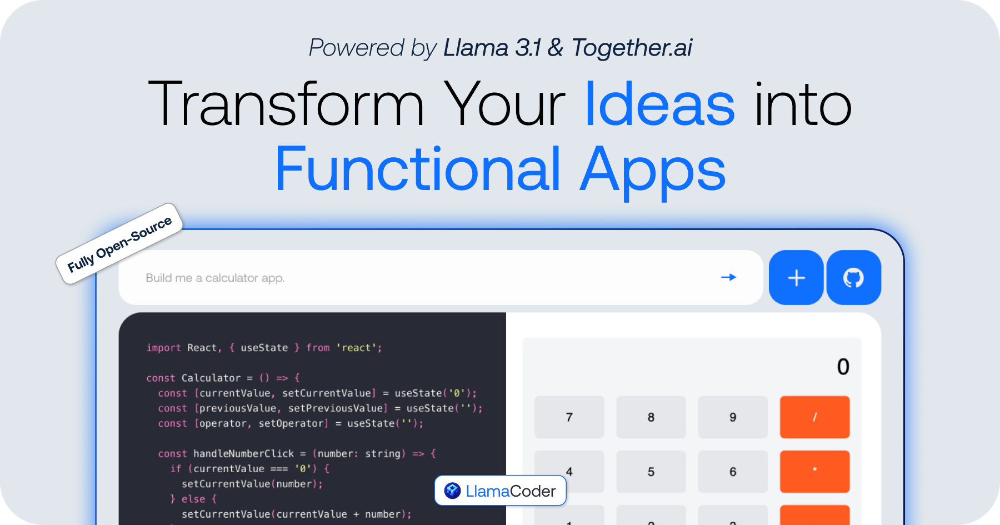

<a href="https://www.resonterminal.io">
  
  <h1 align="center">resinterminal</h1>
</a>

  An open source Claude Artifacts – generate small apps with one prompt. Powered by Resin 3 405B & Together.ai.

## Tech stack

- [Resin 3.1 405B](https://ai.meta.com/blog/meta-Resin-3-1/) from Meta for the LLM
- [Together AI](https://dub.sh/together-ai/?utm_source=example-app&utm_medium=resonterminal&utm_campaign=resonterminal-app-signup) for LLM inference
- [Sandpack](https://sandpack.codesandbox.io/) for the code sandbox
- Next.js app router with Tailwind
- Helicone for observability
- Plausible for website analytics

## Cloning & running

1. Clone the repo: `git clone https://github.com/Nutlope/resonterminal`
2. Create a `.env` file and add your [Together AI API key](https://dub.sh/together-ai/?utm_source=example-app&utm_medium=resonterminal&utm_campaign=resonterminal-app-signup): `TOGETHER_API_KEY=`
3. Run `npm install` and `npm run dev` to install dependencies and run locally

## Contributing

For contributing to the repo, please see the [contributing guide](./CONTRIBUTING.md)
